 

Привет, я Рыба-ёж.

Фулстек: пишу бэкенд, собираю интерфейсы и подключаю всё это к базам и внешним API. Сильнее всего в Python, уверенно пишу на Kotlin и Java, во фронтенде работаю с React и TypeScript.

Отдельная тема для меня, информационная безопасность. Много практики в Kali Linux на своих тестовых серверах: разбираю сетевой трафик, ищу дырки в своих же сервисах и закрываю их.

Сейчас смотрю на позиции уровня middle. Интереснее всего проекты, где есть AI или безопасность.

## Стек

## Что делаю руками

- сервисы и API на Python: схема данных, логика, документация
- телеграм-боты с очередями, платежами и интеграцией LLM
- веб-интерфейсы на React и TypeScript
- моды и плагины для Minecraft на Kotlin и Java
- игровые прототипы в Unity

## Как работаю

- читаемый код и понятные коммиты, чтобы через месяц в нём можно было разобраться
- тесты там, где они реально спасают, а не ради галочки
- сначала разбираюсь в задаче, потом пишу код

## Связаться

[Telegram](https://t.me/arbuzdik) &nbsp; · &nbsp; [VK](https://vk.com/arbyzdi) &nbsp; · &nbsp; [impulseoffiproject@gmail.com](mailto:impulseoffiproject@gmail.com)

English

 

Hi, I am arbuzik.

Fullstack developer: backend, interfaces, databases and third party APIs. Python is my strongest language, I am comfortable with Kotlin and Java, and I use React with TypeScript on the front end.

Information security is my second focus. Plenty of hands on practice with Kali Linux on my own test servers: reading network traffic, finding holes in my own services and closing them.

Currently looking at middle level roles, most interested in projects involving AI or security.

