<div align="center">



<br/>


<br/>


<a href="https://github.com/arbuzikUwU?tab=followers">
  
</a>

</div>


## 👋 Привет! / Hey there!

```ts
const dev = {
  alias:  "Рыба-ёж",
  role:   "fullstack developer",
  layers: ["systems", "backend", "frontend", "gamedev", "AI & automation"],
  langs:  ["Rust", "C", "C++", "C#", "Kotlin", "Java", "Python", "Lua", "JS/TS"],
  motto:  "если это можно автоматизировать — оно будет автоматизировано",
};
```

**🇷🇺 Русский** — фулстек-разработчик: пишу и низкоуровневый код, и бэкенд, и интерфейсы. Одинаково комфортно в системном программировании (C / C++ / Rust), на JVM (Kotlin / Java), в скриптах и автоматизации (Python / Lua) и в вебе (JS / TS / HTML / CSS). Люблю разбираться в незнакомых технологиях и доводить прототип до рабочего продукта.

**🇬🇧 English** — fullstack developer working across the whole range: low-level systems (C / C++ / Rust), JVM services (Kotlin / Java), scripting and automation (Python / Lua) and web interfaces (JS / TS / HTML / CSS). I like digging into unfamiliar tech and turning prototypes into things that actually ship.

<br/>

## 🧰 Стек / Tech Stack

<div align="center">

**Languages**


<br/><br/>

**Frameworks, tools & platforms**


<br/>


</div>

<br/>

## 📊 Статистика / GitHub Stats

<div align="center">


<br/>


</div>

<br/>

## 🚀 Чем занимаюсь / What I do

<div align="center">
<table>
<tr>
<td width="25%" valign="top">

### ⚙️ Systems
Низкоуровневый код, производительность, работа с памятью.

<sub>C / C++ / Rust</sub>

</td>
<td width="25%" valign="top">

### 🧩 Backend
Сервисы, API, боты, базы данных, автоматизация.

<sub>Kotlin / Java / Python</sub>

</td>
<td width="25%" valign="top">

### 🖥 Frontend
Интерфейсы и веб — от вёрстки до логики на TS.

<sub>TS / JS / HTML / CSS</sub>

</td>
<td width="25%" valign="top">

### 🎮 Gamedev & AI
Игровые механики, прототипы, интеграция LLM.

<sub>Unity / C# / Lua / LLM APIs</sub>

</td>
</tr>
</table>
</div>

<br/>

## 🌐 Связаться / Get in touch

<div align="center">

<a href="https://t.me/arbuzdik">
  
</a>
<a href="https://vk.com/arbyzdi">
  
</a>
<a href="mailto:impulseoffiproject@gmail.com">
  
</a>

<br/><br/>

<sub>Открыт к интересным задачам и коллаборациям · Open to interesting work and collaborations</sub>

</div>

<br/>

<div align="center">


<sub>⚡ <i>«Если это можно автоматизировать — оно будет автоматизировано.»</i></sub>

</div>
